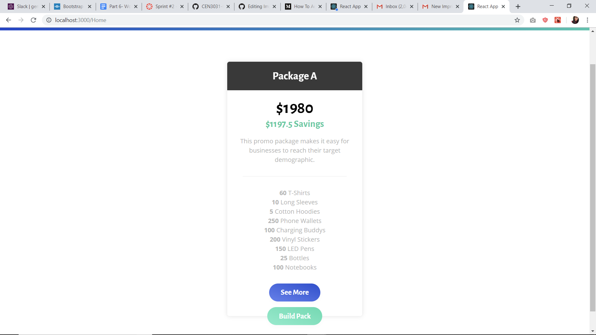
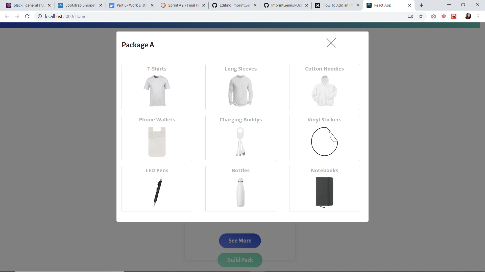
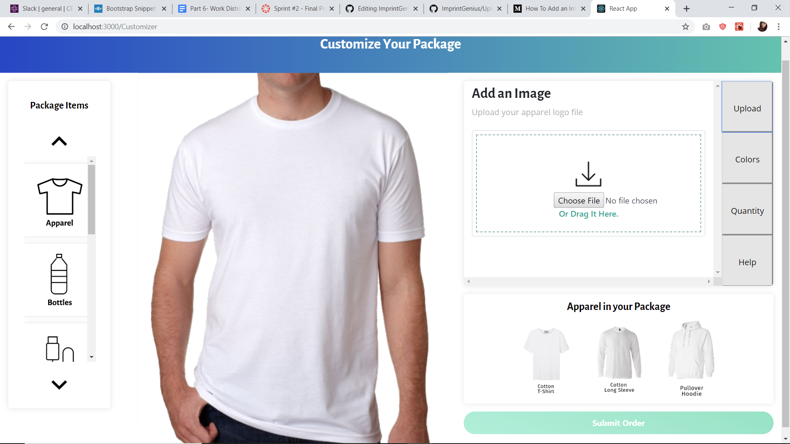
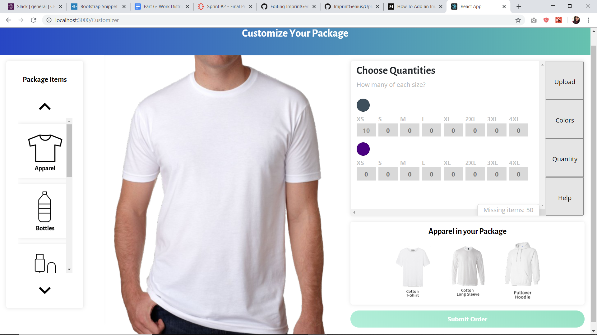
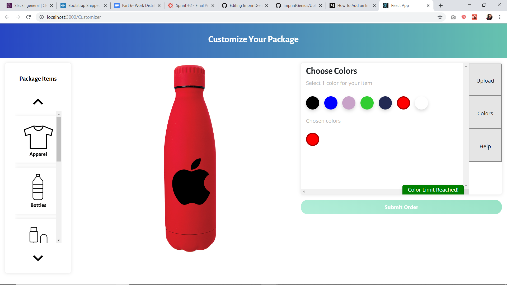
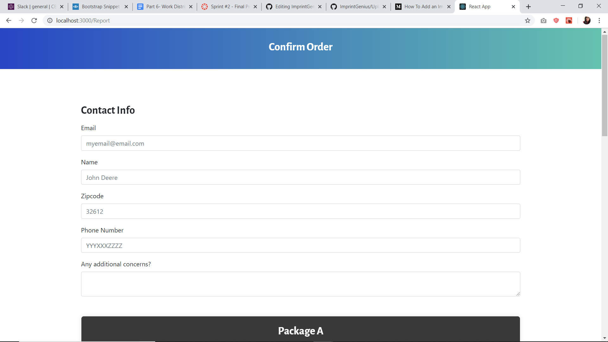
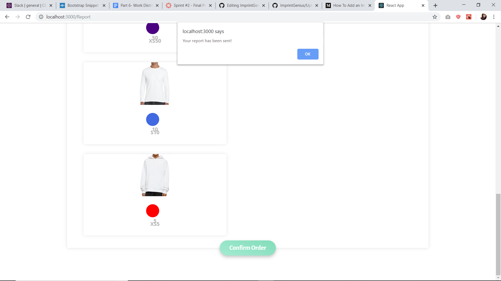
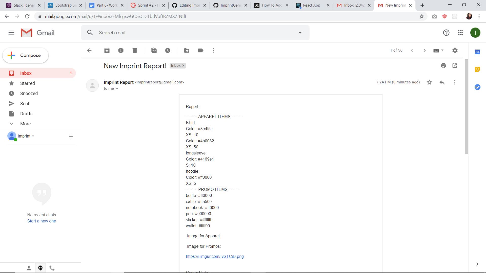

## Overview

This website was built for Imprint Genius for customized package ordering.

Jennifer Bernal: Scrum master, developer, @jenber23

Sneha Patel: Developer

Paula Martins: Developer

Pablo Garces: Project manager, developer

Evan Bourque: Developer

Imprint Genius: Owner of project, provided image assets for apparel and promotional items 

## Link to deployed website
https://imprint-genius.herokuapp.com

## How to run the project locally

To run the project locally, clone the repository to your local machine.
Use npm install to install package dependencies.
Run #### `npm run-script client`

## Heroku instructions

Connecting to Heroku Dashboard
1.	https://id.heroku.com/login
    a.	Log in with same username and password as gmail
2.	https://dashboard.heroku.com/apps
    a.	Select “imprint-genius” as your app on the Heroku homepage
3.	https://dashboard.heroku.com/apps/imprint-genius
    a.	Choose Deployment tab on top header
4.	https://dashboard.heroku.com/apps/imprint-genius/deploy/github
    a.	App connected to GitHub: Ensure app connected to Github is   CEN3031-Group8e/ImprintGenius through the imprintgenius git user account
    b.	Automatic deploys: Enable automatic deployments; leave this on so the website can be continuously updated.
    c.	Manual deploy: Force deployment on command
5.	At the top header, select “Open app” to view deployed site
6.	Viewable on https://imprint-genius.herokuapp.com/

## Features Implemented
Homepage

In the home page  (package page) see more pop up gives an over view of the package.

Build pack takes customer to the customizer where you can upload logo for apparel.

Quantity allows customer to choose different sizes for apparel.

Colors allows customer to choose different colors.

Once all details are filled, submit button is enabled and takes customer to a form for customer details.

Customer can review order and place order. On placing order, customer is notified that the report is sent.

Client recieves order details in the email.

## Additional feature details

Separate logos can be uploaded for apparel and promo items.

The quantity indicates missing quantity and excess quantity based on package details given by the client.

Submit button on customizer is enabled only when all package details are filled in by the customer.

## Packages and code sources used

Email.js 

Bootstrap 

Bootsnipp - https://bootsnipp.com/snippets/DOXy4

## Identified bugs

When trying to access the customizer page directly through the url as a developer, without going through the homepage, it crashes since customizer page relies on the data from the package page.

Data is not saved when customizer or report page is reloaded which can cause a crash.

## Future features

- Add custom logo positioning
- Add descriptions for each individual item
- Change apparel colors when selecting
- Enable customer to go pack to the customizer page once report is filled and keep the original data instead of refreshing

#### README to EXPAND project in the future to include back-end

This is the original readme of the project that we built upon. This can be used to add back-end to the web-app.

This project was bootstrapped with [Create React App](https://github.com/facebook/create-react-app).
This project contains an example project board meant to showcase how one can be used. The issues posted to it are not real issues.

#### _**IMPORTANT NOTE**_ - 
This project does not have a mongoDB connection setup. For:
- local development: create a config file (make sure to name it config.js) in the config folder, which exports your db.uri connection. An example is provided, config/config.example.js. This file will be ignored by git so your db credentials will be kept safe when the app is deployed.
- production: Since the config file is not pushed when you deploy your app, you must specifiy your db uri in heorku. Set the uri in heroku as specified in [this](https://devcenter.heroku.com/articles/config-vars) resource. Make sure you name the environement variable "DB_URI".

## Getting Started
This repository aims to assist you in beginning work on a MERN stack application with a solid file structure as a foundation. To get started make a copy of this template repo for your project teams.

Since this project will hold both the client application and the server application there will be node modules in two different places. First run `npm install` from the root. After this you will run `npm run-script install-all` from the root. From now on run this command anytime you want to install all modules again. This is a script we have defined in package.json .

This app can be deployed directly to heroku since there is a script defined in package.json which will automatically handle building and deploying the app. For more information on deploying to heroku reference the extra resources at the bottom of this file. 

## File structure
#### `client` - Holds the client application
- #### `public` - This holds all of our static files
- #### `src`
    - #### `assets` - This folder holds assets such as images, docs, and fonts
    - #### `components` - This folder holds all of the different components that will make up our views
    - #### `views` - These represent a unique page on the website i.e. Home or About. These are still normal react components.
    - #### `App.js` - This is what renders all of our browser routes and different views
    - #### `index.js` - This is what renders the react app by rendering App.js, should not change
- #### `package.json` - Defines npm behaviors and packages for the client
#### `server` - Holds the server application
- #### `config` - This holds our configuration files, like mongoDB uri
- #### `controllers` - These hold all of the callback functions that each route will call
- #### `models` - This holds all of our data models
- #### `routes` - This holds all of our HTTP to URL path associations for each unique url
- #### `tests` - This holds all of our server tests that we have defined
- #### `server.js` - Defines npm behaviors and packages for the client
#### `package.json` - Defines npm behaviors like the scripts defined in the next section of the README
#### `.gitignore` - Tells git which files to ignore
#### `README` - This file!

## Available Scripts

In the project directory, you can run:

### `npm run-script dev`

Runs both the client app and the server app in development mode. 
Open [http://localhost:3000](http://localhost:3000) to view the client in the browser.

### `npm run-script client`

Runs just the client app in development mode. 
Open [http://localhost:3000](http://localhost:3000) to view the client in the browser.

### `npm run-script server`

Runs just the server in development mode. 

### `npm run build`

Builds the app for production to the `build` folder. 
It correctly bundles React in production mode and optimizes the build for the best performance.

If deploying to heroku this does not need to be run since it is handled by the heroku-postbuild script 

See the section about [deployment](https://facebook.github.io/create-react-app/docs/deployment) for more information.

## Learn More

You can learn more in the [Create React App documentation](https://facebook.github.io/create-react-app/docs/getting-started).

To learn how to setup a local MongoDB instance for testing, check out how to [Connect to MongoDB](https://docs.mongodb.com/guides/server/drivers/).

To learn how to deploy a full-stack web app to heroku, check out [this great guide](https://daveceddia.com/deploy-react-express-app-heroku/).

To learn React, check out the [React documentation](https://reactjs.org/).

### `npm run build` fails to minify

This section has moved here: https://facebook.github.io/create-react-app/docs/troubleshooting#npm-run-build-fails-to-minify
